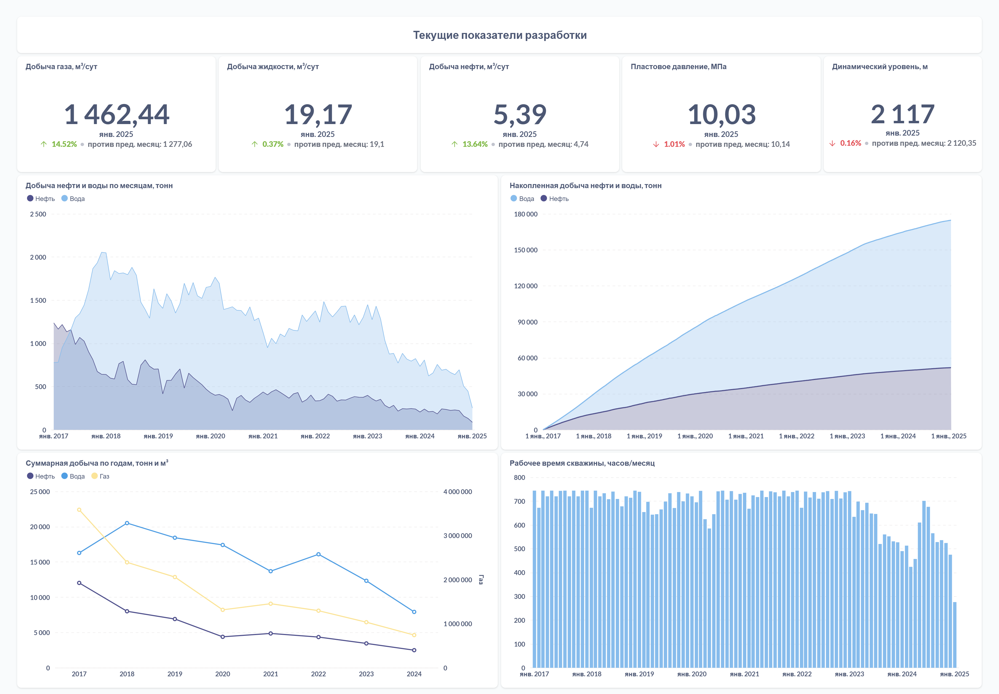

# 🛢️ Oil Production Data Pipeline | Визуализация данных добычи


Этот проект представляет собой **конвейер данных** для обработки и анализа показателей добычи нефти. Данные загружаются из CSV, обрабатываются Python-скриптами, сохраняются в **PostgreSQL** и визуализируются в **Metabase**.  
*(Pet project для анализа суточных показателей добычи)*  

---

## 📌 О проекте

Автоматизированный пайплайн для работы с данными месторождений:
- 📂 Загрузка "грязных" CSV из различных источников
- 🧹 Предобработка (очистка, нормализация)
- 🗄️ Загрузка в PostgreSQL и визуализация в Metabase
- 📊 Готовые дашборды для анализа динамики

> 💡 Проект создан для автоматизации рутинных отчетов нефтяников

---

## Структура проекта

```text
oil-production-pipeline/
├── 📂 data/                    
│   ├── 📂 raw/                 # Исходные CSV-файлы
│   └── 📂 processed/           # Предобработанные данные
├── 📂 scripts/
│   ├── 🐍 data_load.py         # Очистка и трансформация данных
│   └── 🐍 load_to_postgres.py  # Загрузка в PostgreSQL
├── 📂 dashboards               # Примеры визуализаций
├── 🐳 docker-compose.yml       # Конфигурация сервисов
├── 🐋 Dockerfile               # Образ приложения
├── 📜 requirements.txt         # Зависимости Python
└── 📖 README.md                # Документация
```

---

⚙️ Технологии
- Python (Pandas, SQLAlchemy, Psycopg2)
- PostgreSQL (хранение данных)
- Metabase (визуализация)
- Docker (контейнеризация)

---
## 🚀 Быстрый старт

### Запуск через Docker (рекомендуется)
```bash
docker-compose up -d
```
